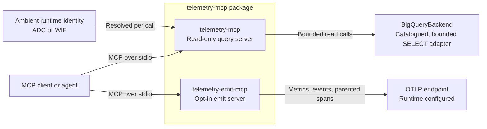

# System Context

`telemetry-mcp` ships two separate stdio MCP servers. The query server provides
bounded read access through an injected metrics backend. The opt-in emit server
sends validated signals to a runtime-configured OTLP endpoint.

The query and emit paths do not share capabilities: `telemetry-mcp` exposes no
mutation or raw-query tool, while `telemetry-emit-mcp` does not register query
tools. `BigQueryBackend` generates only catalogued, parameterized, scan-capped
queries; tests inject a fake client and do not require GCP or network access.

This diagram is hand-maintained because the repository has no manifest that
describes both MCP entrypoints and their adapters. Its source of truth is
`src/telemetry_mcp/mcp_server.py`, `src/telemetry_mcp/core.py`,
`src/telemetry_mcp/backend.py`, `src/telemetry_mcp/emit_mcp_server.py`, and
`src/telemetry_mcp/emit_otlp.py`.
